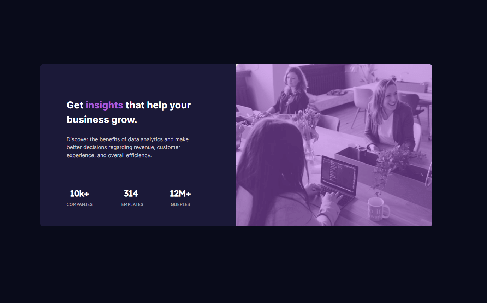

# Frontend Mentor - Stats preview card component solution

This is a solution to the [Stats preview card component challenge on Frontend Mentor](https://www.frontendmentor.io/challenges/stats-preview-card-component-8JqbgoU62). Frontend Mentor challenges help you improve your coding skills by building realistic projects.

## Table of contents

- [Overview](#overview)
  - [The challenge](#the-challenge)
  - [Screenshot](#screenshot)
  - [Links](#links)
- [My process](#my-process)
  - [Built with](#built-with)
  - [What I learned](#what-i-learned)
- [Author](#author)

## Overview

### The challenge

Users should be able to:

- View the optimal layout depending on their device's screen size

### Screenshot



### Links

- Live Site URL: [Add live site URL here](https://your-live-site-url.com)

## My process

### Built with

- Semantic HTML5 markup
- Flexbox
- Vite
- [React](https://reactjs.org/) - JS library
- [TailwindCSS](https://tailwindcss.com) - CSS Utility Framework

### What I learned

I learned to create a color overlay over an image. I handled this by adding a simple div with z-index and a "transparent" background.

```html
<div className="relative desktop:w-1/2">
  <div
    className="w-full h-full z-20 absolute bg-soft-violet/50 desktop:rounded-r-lg rounded-t-lg"
  ></div>
  
</div>
```

## Author

- Website - [https://challenges.schman.dev](https://challenges.schman.dev)
- Frontend Mentor - [@schmanat](https://www.frontendmentor.io/profile/schmanat)
